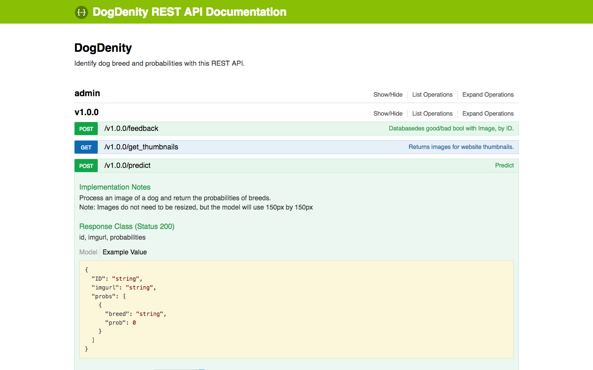
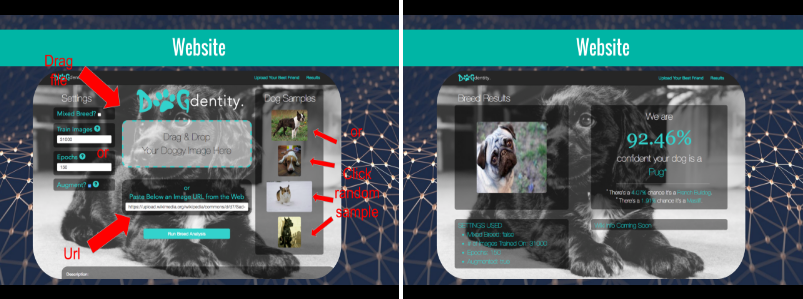

# DogDentity API

## Overview

This API is used to both my DogDenity project, which identifies dog breed within images. You feed the API images, and it returns probabilites of each breed. It also returns random sample tumbnails from the DogDenity training set. 

This API is very simple and easy to use. There was no reason to make it complex!

## Website Demo
### API

### Website

## Documentation

Powered by Swagger-UI: [FaceInfo REST API Documentation](http://faceinfo.fishpoke.com:5000/)

## Technologies Used

- [python](https://www.python.org/)
- [flask](http://flask.pocoo.org/)
- [flask-swagger](https://github.com/gangverk/flask-swagger)
- [Swagger-UI](https://github.com/swagger-api/swagger-ui)
- [OpenAPI Specification](https://github.com/OAI/OpenAPI-Specification/) (fla _Swagger Spec_)
- [OpenCV](http://opencv.org/)
- [Keras](http://keras.io/)
